<h1>Ejercicios ficheros y funciones</h1>

<h1>Parametros variables

Crea las siguientes funciones:
Una función que devuelva el mayor de todos los números recibidos como parámetro variables:
function mayor(): int. Utiliza las funciones func_get_args(), etc... No puedes usar la función max().

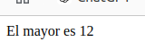

<h1>Comprobar hora </h1>

Crea una variable de texto con una hora en ella (por ejemplo, “21:30:12”), y luego procésala para extraer
por separado la hora, el minuto y el segundo, y comprobar si es una hora válida. Por ejemplo, la hora
anterior sí debería ser válida, pero si ponemos “12:63:11” no debería serlo, porque 63 no es un minuto
válido.

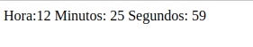

<h1>Matematicas</h1>

Añade las siguientes funciones:
PHP Curs 2024-2025
• digitos(int $num): int → devuelve la cantidad de dígitos de un número.
• digitoN(int $num, int $pos): int → devuelve el dígito que ocupa, empezando por la
izquierda, la posición $pos.
• quitaPorDetras(int $num, int $cant): int → le quita por detrás (derecha) $cant
dígitos.
• quitaPorDelante(int $num, int $cant): int → le quita por delante (izquierda) $cant
dígitos.

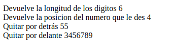

<h1>Frases impares</h1>

Lee una frase y devuelve una nueva con solo los caracteres de las posiciones impares.

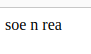

<h1>Analizador</h1>

A partir de una frase con palabras sólo separadas por espacios, devolver:
• Letras totales y cantidad de palabras
• Una línea por cada palabra indicando su tamaño
Nota: no se puede usar str_word_count

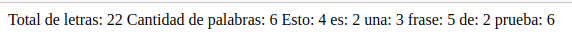

<h1>Analizador WC</h1>

Investiga que hace la función str_word_count, y vuelve a hacer el ejercicio.

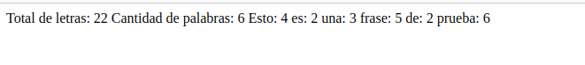

<h1>Cani</h1>

EsCrIbE uNa FuNcIóN qUe TrAnSfOrMe UnA cAdEnA eN cAnI.

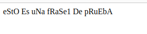

<h1>Palindromo</h1>

Escribe una función que devuelva un booleano indicando si una palabra es palíndroma (se lee igual de
izquierda a derecha que de derecha a izquierda, por ejemplo, "ligar es ser agil").

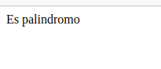

<h1>Plantillas</h1>

• Con el fichero plantillas.csv muestra en un tabla HTML su contenido.
– Muestra solo El Dorsal, Nombre, Apellidos, posicion y Equipo.
– Muestra la plantilla del Atlético de Madrid ordenada por dorsal.

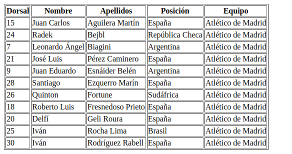

<h1>Casas rurales</h1>

Crea un programa llamado CasasRuralesTelefonos.php que cargue los datos de este archivo CSV
de casas rurales de la provincia de Castellón. Queremos quedarnos con el id, localidad, nombre y
telefono de las casas rurales que tengan un teléfono definido, descartando el resto. El programa debe
mostrar por pantalla el listado final procesado, y cuántas casas rurales se han descartado por tener
datos nulos.

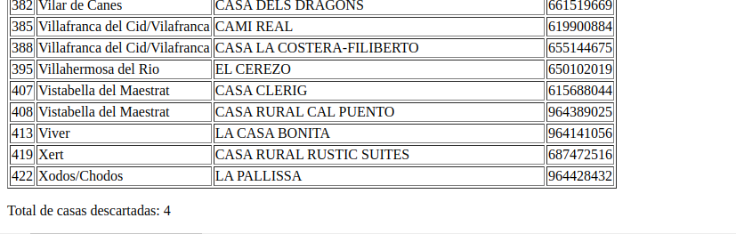

<h1>Apuestas del estado</h1>

Queremos realizar una página en el servidor que me genere de forma aleatoria una apuesta de primitiva
u otra de euromillones. Para realizar el script en PHP deberemos tener en cuenta que:
• PRIMITIVA Una apuesta de 6 números entre 49 posibles (del 1 al 49).
• EUROMILLONES Una apuesta de 5 números entre 50 posibles (del 1 al 50) más 2 estrellas de entre
9 posibles (del 1 al 9).
Además vamos a utilizar programación modular y para ello se nos proporciona el siguiente DEM
(Diagrama de Estructura de Módulos):

Deberemos implementar el código HTML con dos enlaces para select_apuesta.html que enlazarán
a los scripts:
• primitiva.php encargado de mostrar una apuesta ordenada de lotería primitiva.
Implementando los módulos del DEM para primitiva.
• euromillones.php encargado de mostrar una apuesta ordenada de euromillones.
Implementando los módulos del DEM para euromillones.
Intentaremos implementar cada módulo del DEM como una función en PHP de tal manera que aquellos
que sean comunes a primitiva.php y euromillones.php los introduciremos en la librería loteria.inc.
Un ejemplo, “cutre”, de visualización final puede ser:

Resultado de primtiva

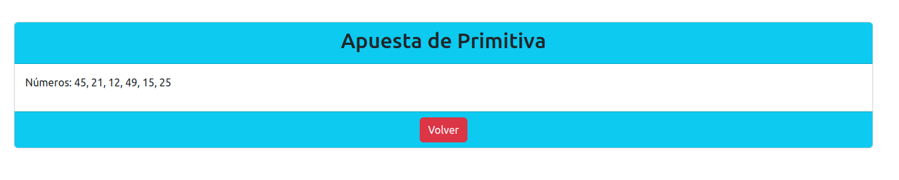