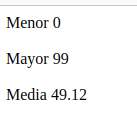
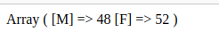
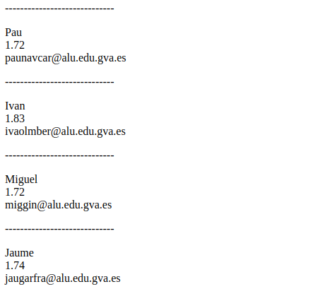
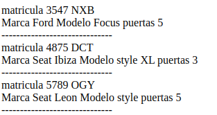

<h1>Ejercicios - Arrays</h1>

Rellena un array con 50 números aleatorios comprendidos entre el 0 y el 99, y luego muéstralo en una
    lista desordenada. Para crear un número aleatorio, utiliza la función rand(inicio, fin) => $num = rand
    (0, 99)
    • Como mejora comprobar que los números no existan.
    • Ordenar la salida del vector.
    • Calcula:
    – El mayor
    – El menor
    – La media

<h1>Array asociativo</h1>

    Rellena un array de 100 elementos de manera aleatoria con valores M o F (por ejemplo [“M”, “M”, “F”,
“M”, ... ]). Una vez completado, vuelve a recorrerlo y calcula cuantos elementos hay de cada uno de los
valores almacenando el resultado en un array asociativo [‘M’ => 44, ‘F’ => 66] (no utilices variables
para contar las M o las F). Finalmente, muestra el resultado por pantalla

<h1>Personas</h1>

Mediante un array bidimensional, almacena el nombre, altura y email de 5 personas. Para ello, crea
un array de personas, siendo cada persona un array asociativo: [ [‘nombre’=>‘Aitor’, ‘altura’=>182,
‘email’=>‘aitor@correo.com’],[. . . ],. . . ] Posteriormente, recorre el array y muéstralo en una tabla
HTML.

<h1>Garaje</h1>

Crea una página llamada coches.php. Define dentro un array bidimensional mixto donde:
La primera dimensión sea asociativa. Aquí pondremos matrículas de coches. La segunda dimensión
será numérica. En cada casilla guardaremos la marca, modelo y número de puertas del coche en
cuestión. Por ejemplo, el coche con matrícula “111BCD” puede ser un “Ford” (casilla 0), modelo “Focus”
(casilla 1) de 5 puertas (casilla 2). Rellena el array con al menos 3 o 4 coches, y después utiliza las
estructuras adecuadas para recorrerlo mostrando los datos de los coches ordenados por matrícula.

