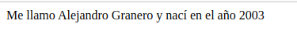
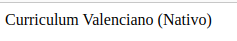
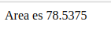
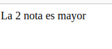
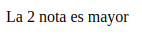
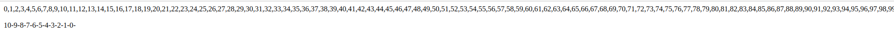

<h1>1er ejercicio php</h1>

Crea una carpeta llamada ejercicios1 en tu carpeta de documentos de XAMPP y subirlo a
github. En esta carpeta guardarás este ejercicio y los siguientes, ya que serán muchos y
así evitamos llenar la carpeta de documentos de demasiadas subcarpetas con ejercicios
cortos.
Para este ejercicio, crea un documento en esta carpeta llamado info_basica.php, similar
al del ejemplo anterior, pero mostrando tu nombre y tu año de nacimiento usando
variables. Es decir, crearás dos variables para almacenar estos dos datos, y los mostrarás
en una frase que diga “Me llamo XXXX y nací en el año YYYY”.
Prueba la página en un navegador y echa un vistazo al código fuente, intentando detectar
qué contenidos HTML se han generado desde PHP.

<h1>Curriculum</h1>

Crea una página en la carpeta de ejercicios llamada curriculum.php donde, utilizando
variables variables, muestres parte de tu currículum (por ejemplo, un párrafo con tus
estudios y otro con los idiomas que hablas), tanto en español,valencià como en otro
idioma que elijas.

<h1>Area circulo</h1>

Ejercicio 3: Crea una página en la carpeta de ejercicios llamada area_circulo.php. En
ella, crea una variable $radio y ponle el valor 3.5. Según esa variable, calcula en otra
variable el área del círculo (PI * radio2
), deberás definir la constante PI, y muestra por
pantalla el texto “El área del círculo es XX.XX”, donde XX.XX será el resultado de calcular
el área

<h1>Prueba if</h1>

Ejercicio 5
Crea una página llamada prueba_if.php en la carpeta de ejercicios del tema. Crea
en ella dos variables llamadas $nota1 y $nota2, y dales el valor de dos notas de
examen cualesquiera (con decimales si quieres). Después, utiliza expresiones if..else para
determinar qué nota es la mayor de las dos

<h1>Ej 6</h1>

Ejercicio 6
Modifica el ejercicio anterior añadiendo una tercera nota $nota3 , y determinando cuál
de las 3 notas es ahora la mayor. Para ello, deberás ayudarte esta vez de la estructura
if..elseif..else.

<h1>Ej7</h1>

Ejercicio 7
Crea una página llamada contador.php en la carpeta de ejercicios del tema. Utiliza una
estructura for para contar los números del 1 al 100 (separados por comas), y luego una
estructura while para contar los números del 10 al 0 (una cuenta atrás, separada por
guiones).
Al final debe quedarte algo como esto:
1,2,3,4,5,6,7,8,9,10,11,12,13,14,15...
10-9-8-7-6-5-4-3-2-1-0

