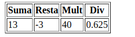
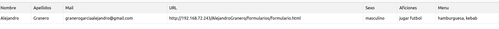
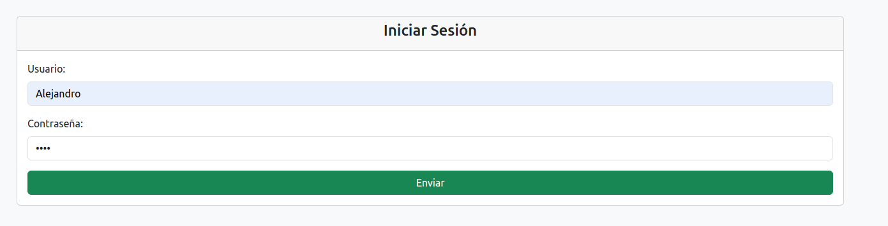
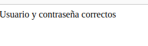
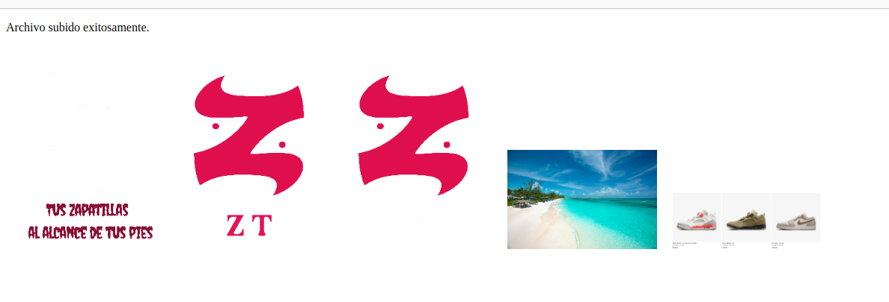
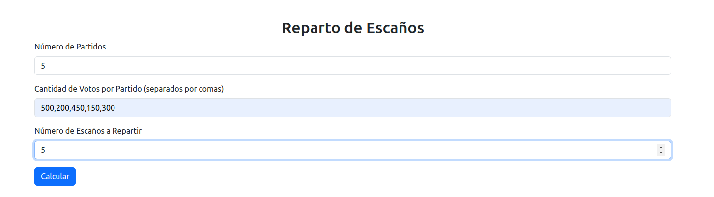
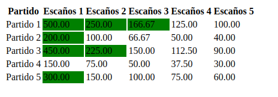

<h1>Calculadora</h1>

5.0.1 calculadora.php
Escribe un programa calculadora.php que acepte por la dirección las variables $x y $y y que:
Muestra por pantalla:
• El valor del array $_GET (utiliza la función print_r())
• La suma, resto, multiplicación y división de x e y.
• El valores de la variable $_SERVER.
• ¿Cual es el ordenador que hace la petición?
• En qué variable están los parámetros de la petición.
• ¿Qué es la ruta del sitio web en el ordenador local ?
• Utilitza una vista para mostrar el resultado. calculadora.view.php

<h1></h1>

Crea un formulario(utiliza bootstrap) que solicite:
• Nombre y apellidos.
• Email.
• URL página personal.
• Sexo (radio).
• Número de convivientes en el domicilio.
• Aficiones (checkboxes) => poner mínimo 4 valores.
• Menú favorito (lista selección múltiple) => poner mínimo 4 valores.
• Muestra los valores cargados en una tabla-resumen.

<h1>Login</h1>

Vamos a simular un formulario de acceso:
login.php: el formulario de entrada, que solicita el usuario y contraseña. compruebaLogin.php:
recibe los datos y comprueba si son correctos (los usuarios se guardan en un array asociativo) pasando
el control mediante el uso de include a:
ok.php: El usuario introducido es correcto
ko.php: El usuario es incorrecto. Informar si ambos están mal o solo la contraseña. Volver a mostrar el
formulario de acceso.

<h1>Subida de imagen</h1>

(utiliza bootstrap)
Crea un formulario que permita subir unicamente imágenes (comprueba la propiedad type del archivo
subido). Si el usuario selecciona otro tipo de archivos, se le debe informar del error y permitir que suba
un nuevo archivo. En el caso de subir el tipo correcto, visualizar la imagen durante 5 segundos,con la
ruta y nombre, tamaño de anchura y altura y redirecciona al formulario. También hay que crear un
enlace para mostrar el listado de todas las imagenes subidas.(analiza/estudia el método scandir()
).

<h1>Escaños</h1>

Nos piden el diseño de una página web donde introduzcamos el número de partidos políticos, la
cantidad de votos por partido y el número de escaños a repartir y nos devuelva una tabla como la
siguiente:
• Donde las columnas son el Total de votos del partido dividido entre el número de escaños.
– 500.000/1, 500.000/2 ... 500.000/7 y así con los 4 partidos.

Donde hemos metido los 4 partidos el número total de votos por partido 500.000, 300.000, 150.000 y
50.000 respectivamente y el total de escaños a repartir, en este caso 7. Si nos fijamos y simplificando mucho hay que marcar las 7 cantidades mayores

